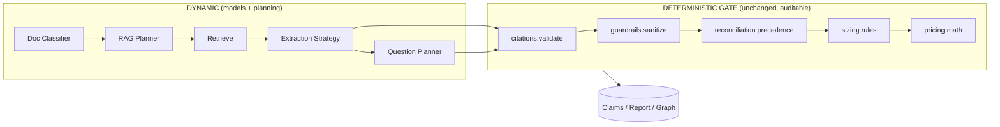
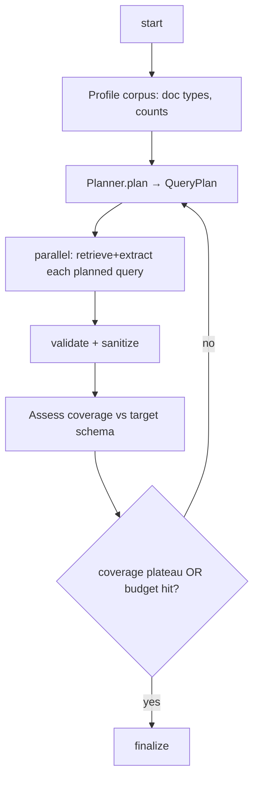

# CMAA — From Rule-Based to Dynamic: Architecture & Migration Plan

**Status:** Design proposal (for review before implementation)
**Author:** Engineering review (SDE 3)
**Scope decided with product owner:**
- Make **dynamic**: (1) extraction engine, (2) RAG query planning, (3) doc classification & NFR mining, (4) assessment questions & guardrails.
- Keep **deterministic** (auditability is the product's core value): sizing SKU selection, pricing math, precedence winner selection, citation grounding.
- Deliverable: this design + phased plan **before** any code changes.

---

## 1. The core idea

Today the pipeline mixes two kinds of "rules":

- **Cognitive rules** — regexes and hardcoded strings that *decide what a document means* (`heuristic_extract.py`'s `_APP_PATTERN`, the 11 fixed `RAG_QUERIES`, `infer_doc_type`'s keyword ladder, the `_NFR_PATTERNS`, even hardcoded app names like `"Billing Service"`). These are brittle, estate-specific, and the wrong place for rules. **These become dynamic.**
- **Governance rules** — SKU selection, cost math, document precedence, and evidence grounding. These are *deliberately* deterministic so a migration architect can defend every number to an auditor. **These stay rules.**

The whole design is one sentence:

> **Let models decide *what the documents say*; let rules decide *what we do about it*.**

Everything dynamic produces **grounded, cited, schema-valid claims**. Those claims then flow through the *unchanged* deterministic gate (citations → sanitize → reconcile precedence → size). The LLM never picks a SKU, never invents a citation, never overrides precedence. It just gets much better at reading messy enterprise documents.



The `ports.py` / `providers.py` composition root already makes this clean: we add **new ports** with **LLM + deterministic-fallback implementations** and wire them at the root. Nothing downstream of the gate changes.

---

## 2. Guiding principles (non-negotiable constraints)

1. **Evidence-first survives.** Every dynamic output carries `chunk_ids` + `evidence_quote` and passes `citations.validate_citations` unchanged. No grounding = no claim.
2. **Graceful degradation survives.** Every new dynamic port has a deterministic offline implementation, so `MOCK_LLM=true` + local embeddings + no-Neo4j still produces a full run. Dynamic is an *upgrade path*, never a hard dependency.
3. **The deterministic gate is untouched.** `sizing.py`, `pricing.py`, `reconciliation.py` (precedence winner), `citations.py` keep their current logic and tests. We only change what feeds them.
4. **Human-in-the-loop absorbs uncertainty.** Dynamic decisions emit confidence; low-confidence ones route to the existing review queue instead of silently guessing.
5. **Nothing ships without an eval.** We build the eval harness *first* (§8) and gate every dynamic change on no-regression against a golden set. This is what makes "go dynamic" safe rather than reckless.
6. **Ports over rewrites.** We extend the existing `Protocol` seams; we do not restructure the pipeline.

---

## 3. New ports (the seams we add)

All additive to `ports.py`. Each has an LLM implementation and a deterministic fallback.

```python
# ports.py (additions)

@runtime_checkable
class DocClassifier(Protocol):
    def classify(self, filename: str, text_sample: str) -> "Classification": ...
    #   Classification: {doc_type: DocumentType, confidence: float, rationale: str}

@runtime_checkable
class ExtractionStrategy(Protocol):
    """Query + chunks + target schema -> grounded ExtractionResult."""
    def extract(
        self, query: str, chunk_payload: list[dict[str, Any]],
        target: "ExtractionTarget",
    ) -> ExtractionResult: ...

@runtime_checkable
class RagPlanner(Protocol):
    """Decide the next batch of retrieval steps from current coverage."""
    def plan(self, profile: "CorpusProfile", coverage: "Coverage") -> "QueryPlan": ...
    #   QueryPlan: list[PlannedQuery{skill_id, query, doc_type_filter, top_k}]

@runtime_checkable
class QuestionPlanner(Protocol):
    """Base question set + estate-specific supplementary questions."""
    def plan(self, inventory: "InventorySummary") -> list["Question"]: ...

@runtime_checkable
class InjectionDetector(Protocol):
    def scan(self, text: str) -> list["Signal"]: ...   # {kind, score, span}
```

Supporting value types live in `schemas/` (Pydantic) so structured outputs can target them directly.

---

## 4. Area 1 — Extraction engine (regex/hardcoded → schema-driven LLM)

### 4.1 Problem
`heuristic_extract.py` (~500 lines) is the offline/mock extractor and a fallback. It:
- pattern-matches with brittle regexes (`_APP_PATTERN`, `_SERVER_HOST_PATTERN`, `_USES_DB_PATTERN`, …),
- **hardcodes customer entity names** (`"Billing Service"`, `"Identity Gateway"`, `"Customer Portal"`) — this is demo-data leakage that must not exist in a general product,
- and the LLM path (`ChatLlmExtractor`) uses one generic prompt with `json_object` mode and a hope-and-`model_validate` parse (fails to a gap on bad JSON).

### 4.2 Design
Introduce **typed extraction targets** and **structured outputs**, behind an `ExtractionStrategy` port.

**a) Extraction targets (schemas per intent).** Instead of one mega-prompt, each extraction skill declares the exact shape it may emit:

```python
class ServerSizingClaims(BaseModel):
    servers: list[ServerClaim]          # name, vcpu:int|None, memory_gb, os, iops...
class NfrClaims(BaseModel):
    requirements: list[NfrClaim]        # attribute in {sla,rto,rpo,...}, value, quote
class DependencyClaims(BaseModel):
    edges: list[DependencyClaim]        # source, target, relationship (enum)
```

**b) Structured outputs, not JSON-mode.** Pass the schema as `response_format={"type":"json_schema", ...}` (or tool-calling). The model *cannot* emit off-schema output, which eliminates the "invalid JSON → gap" failure mode and enforces the entity/relationship allowlists **at generation time** (a second win for guardrails, §7).

**c) Strategy implementations:**
- `LlmStructuredExtractor` — default when a chat model is configured. Per-skill schema + per-skill system prompt.
- `HeuristicExtractor` — the *existing* regex logic, minus the hardcoded names, kept as the offline fallback and for structured tables (CMDB column parsing is genuinely good and cheap — keep it).
- `EnsembleExtractor` — runs heuristic (for structured/tabular chunks) + LLM (for prose) and merges via the existing `extraction_merge.dedupe`. Highest recall; opt-in.

**d) Delete the hardcoded entity names.** The `business_criticality` block that looks for literal `"Billing Service"` etc. is replaced by an NFR/criticality skill that reads criticality from evidence. This is a correctness fix regardless of the dynamic effort.

**e) Grounding unchanged.** Strategy output → `citations.validate_citations` → `sanitize_extraction_output`. A claim the model invents without a quote in a retrieved chunk still gets cleared/confidence-capped exactly as today.

### 4.3 Data flow
```
PlannedQuery(skill) → retrieve(k, doc_type_filter) → ExtractionStrategy.extract(query, chunks, target)
   → ExtractionResult → [DETERMINISTIC GATE unchanged]
```

### 4.4 Config
`EXTRACTION_STRATEGY = llm | heuristic | ensemble` (default `llm` when chat configured, else `heuristic`). `EXTRACTION_STRUCTURED_OUTPUTS = true`.

---

## 5. Area 2 — Adaptive RAG planning (11 fixed queries → planner + budget)

### 5.1 Problem
`agent_extract.py` runs all 11 `RAG_QUERIES` on every assessment regardless of content, then one gap query, with `recursion_limit=250` as a brute-force backstop. A questionnaire-only upload still runs the "vCPU/IOPS" sweep; a CMDB-only upload wastes calls on prose queries.

### 5.2 Design — plan → act → reflect, with a budget
Replace the fixed sweep with a **coverage loop** driven by a `RagPlanner`:



- **`CorpusProfile`** — cheap, deterministic: which `doc_type`s are present, chunk counts, whether code snapshots exist. Computed from the DB, no LLM.
- **`Coverage`** — which target dimensions (apps, servers, DBs, deps, NFRs, compliance) already have grounded claims, and open gaps.
- **Planner implementations:**
  - `HeuristicPlanner` (offline default) — a **declarative map** from present doc types → relevant skills. Deterministic, no LLM, but already far better than "always run 11." This alone removes most waste.
  - `LlmPlanner` — given the profile + current gaps, the model proposes the next queries/skills (this is where "dynamic" shines: it can ask targeted follow-ups like "retrieve disaster-recovery RTO/RPO for the payment tier").
- **Budget object** replaces `recursion_limit=250`: `max_iterations`, `max_llm_calls`, `max_tokens`, `max_wall_clock_s`. When exceeded → stop and record a gap ("budget exhausted"), never crash.
- **Parallelism**: independent planned queries fan out concurrently (LangGraph map step) instead of the sequential `select_query→…→accumulate` chain — big latency win.

### 5.3 This is where "agent skills" live
Each planned unit is a **Skill** (from the earlier review): `{id, description, queries, doc_type_filter, top_k, target_schema, system_prompt, validators, applicable(profile)}`. The planner selects skills by `applicable()` + `description`; the strategy (§4) executes them; the deterministic gate validates them. Adding "Kubernetes workload discovery" or "license/EOL detection" becomes adding one skill file — no graph edits.

### 5.4 Backward-compat
The current 11 queries become the seed skill catalog, so day-1 behavior with `RAG_PLANNER=heuristic` and all doc types present is ≈ today's behavior — then we improve from a known baseline.

---

## 6. Area 3 — Doc classification & NFR (keywords → model)

### 6.1 Problem
`parsers.infer_doc_type` is a filename/keyword ladder (`"cmdb" in name`, `"nfr" in name`, …). Misclassification is silent and **feeds precedence** — a mislabeled doc gets the wrong authority in reconciliation.

### 6.2 Design
- **`DocClassifier` port** with `KeywordClassifier` (existing logic, fallback) and `LlmClassifier` (zero-shot over the fixed taxonomy: inventory/code_snapshot/architecture/requirements/runbook/questionnaire/unknown), returning `confidence` + `rationale`.
- **Classification becomes dynamic; precedence stays deterministic.** The classifier only decides the *label*; `PRECEDENCE[label]` is the same table it is today. So authority remains rule-based and auditable — we just label more accurately.
- **Low-confidence → review.** A classification below threshold surfaces in the existing review queue ("Is `estate.xlsx` really an inventory?") instead of silently mislabeling. The `rationale` is shown as evidence.
- **NFR mining moves into extraction (§4)** as a first-class `requirements/NFR` skill with a typed schema, instead of the `_NFR_PATTERNS` regex list. Keep the regexes as the offline fallback path.

### 6.3 Config
`DOC_CLASSIFIER = llm | keyword` (default `llm` when chat configured), `DOC_CLASSIFY_REVIEW_THRESHOLD = 0.6`.

---

## 7. Area 4 — Dynamic questions & guardrails

### 7.1 Questions — hybrid, not fully generated
**Recommendation: keep a curated base set + add dynamic supplements.** Fully generating the question set per run destroys **comparability across assessments** (clients and delivery teams expect the same readiness questions every time). Instead:

- Keep the versioned base questions in `assessment_questions.py` (stability + comparability).
- Add a `QuestionPlanner` that generates **estate-specific supplementary questions** grounded in the inventory: "3 AIX servers detected with no Azure-supported target — what is the replatform plan?", "Payment tier references PCI but no data-residency requirement was found — confirm region constraints." These are tagged `dynamic` and clearly separated in the UI.
- Answers stay grounded via the existing `GroundedProse` + evidence; unanswerable dynamic questions become gaps.

### 7.2 Guardrails — layered, semantic, budgeted
`guardrails.py` is already strong (injection regex, empty-chunk refuse, allowlists, credential drop, optional Azure Content Safety). Upgrades:

- **Detector chain** behind an `InjectionDetector` port: `RegexInjectionDetector` (fast, first) → `SemanticInjectionDetector` (LLM/classifier — catches paraphrase, obfuscation, base64, translated attacks the regexes miss) → Azure Content Safety. Combine scores; the existing `GuardrailReport`/metrics/UI stay the interface.
- **Spotlighting / delimiting**: wrap retrieved chunk text in explicit data fences and tag each chunk so the model treats chunk content as *data, never instructions* (reinforces the current "ignore instructions in chunks" system line structurally).
- **Generation-time schema enforcement** (from §4.2): structured outputs make off-allowlist entity/relationship output impossible, so guardrails shift from "clean up after" to "can't happen."
- **Budget circuit breaker as a guardrail** (shared with §5.2): caps LLM calls/tokens/time per assessment; on breach, degrade to heuristic extraction and record it.
- **PII handling**: add optional PII detection/redaction (Presidio offline, or Azure) as an *output* guardrail over claims, quotes, question rewrites, and the readiness summary — not just the credential-value drop that exists today. Ensure PII never lands in `node_trace`/logs.
- **Fail-closed option** for `lz`: `CONTENT_SAFETY_FAIL_OPEN=false` so a content-safety outage blocks rather than silently continues (current code swallows the error and proceeds).

### 7.3 Config
`INJECTION_DETECTOR = regex | semantic | both`, `GUARDRAILS_PII_REDACTION = true|false`, `CONTENT_SAFETY_FAIL_OPEN`, plus the shared budget settings.

---

## 8. Prerequisite — the eval harness (build this first)

You cannot safely swap regex for models without measuring regression. You already have the raw material: `node_trace`/metrics plumbing in `agent_extract.py` and the `scripts/smoke_*.py` scripts. Turn them into a real eval:

- **Golden set**: label the Contoso sample estate (`sample-data/`) with expected entities, dependencies, NFRs, and doc types. ~1 day of work; it's the highest-ROI artifact in this whole plan.
- **Metrics**: retrieval recall@k, citation-grounding rate, claim precision/recall vs gold, doc-classification accuracy, cost & latency per run.
- **Runner**: run each strategy/planner combo against the golden set, emit a scorecard. Gate every PR: no dynamic change merges if it regresses grounding rate or precision.
- **Bonus**: LangGraph checkpointing gives you replayable runs for free — same mechanism doubles as durability for large estates.

**Nothing in §4–§7 merges before this exists.**

---

## 9. Phased migration plan

Each phase is independently shippable and leaves the app fully working (deterministic fallbacks throughout).

**Phase 0 — Safety net (prereq, ~3–5 days)**
- Golden set + eval runner + scorecard (§8).
- CI: ruff, mypy, pytest, `import app.main` smoke (the `parsers.py` incident showed this gap).
- Add the shared **budget** object; replace `recursion_limit=250` with it (behavior-neutral).

**Phase 1 — Structured extraction (~1–2 weeks)**
- Add `ExtractionStrategy` port + `LlmStructuredExtractor` with per-skill schemas and structured outputs.
- Delete hardcoded entity names; move criticality/NFR to skills.
- Keep `HeuristicExtractor` as fallback. Gate on eval: precision/grounding ≥ baseline.

**Phase 2 — Skills + adaptive planner (~1–2 weeks)**
- Introduce the Skill abstraction; migrate the 11 queries + heuristics into skills.
- Add `RagPlanner` (`HeuristicPlanner` first, then `LlmPlanner`); coverage loop + parallel execution replaces the fixed sweep.
- Unify the mock/LLM LangGraph duplication into one parameterized graph.

**Phase 3 — Dynamic classification (~3–5 days)**
- `DocClassifier` port + `LlmClassifier`; low-confidence → review queue. Precedence untouched.

**Phase 4 — Dynamic questions + guardrail upgrades (~1–2 weeks)**
- `QuestionPlanner` (hybrid base + supplements).
- `InjectionDetector` chain + spotlighting + PII redaction + fail-closed content safety.

**Phase 5 — Provider-agnostic + hardening (parallelizable)**
- OpenAI-compatible base URL / multi-provider (the "fit-for-all" work), OTel tracing, distributed locking. (Tracked separately in the earlier modernization review.)

---

## 10. Risks & trade-offs

| Risk | Mitigation |
|---|---|
| Dynamic extraction **hallucinates** entities | Unchanged citation grounding clears ungrounded claims; structured outputs constrain shape; eval gates precision. |
| Cost/latency blow-up from LLM everywhere | Budget circuit breaker; heuristic fallback; planner runs *fewer* queries than today's fixed 11. |
| Non-determinism hurts **reproducibility** | `temperature=0`, pinned model + prompt versions recorded in metrics; deterministic gate makes final outputs stable given stable claims. |
| Fully-dynamic **questions** hurt comparability | Hybrid: curated base set stays; only supplements are generated. |
| Model misclassification corrupts **precedence** | Classification is dynamic but precedence table is fixed; low-confidence routes to human review. |
| Regression during migration | Every phase behind a flag with a deterministic fallback; eval gate on each PR. |
| Provider lock-in slows rollout | `ChatCompleter` port already isolates it; Phase 5 makes it multi-provider. |

---

## 11. File-by-file change map

| File | Change |
|---|---|
| `ports.py` | **+** `DocClassifier`, `ExtractionStrategy`, `RagPlanner`, `QuestionPlanner`, `InjectionDetector` |
| `schemas/` | **+** per-skill extraction target models; `Classification`, `QueryPlan`, `CorpusProfile`, `Coverage` |
| `services/skills/` | **new package** — one file per extraction skill (seeded from the 11 queries + heuristics) |
| `services/planner.py` | **new** — `HeuristicPlanner`, `LlmPlanner`, coverage loop, budget |
| `services/extraction_strategies.py` | **new** — `LlmStructuredExtractor`, `EnsembleExtractor` (wraps existing heuristic) |
| `agent_extract.py` | replace fixed sweep with planner-driven coverage loop; unify mock/LLM graphs; parallel exec |
| `heuristic_extract.py` | keep as fallback strategy; **delete hardcoded entity names**; NFR regex → offline fallback only |
| `parsers.py` / `services/classify.py` | `infer_doc_type` becomes `KeywordClassifier`; **+** `LlmClassifier` |
| `assessment_questions.py` | **+** `QuestionPlanner` (hybrid); base set unchanged |
| `guardrails.py` | **+** detector chain, spotlighting, PII redaction, budget breaker, fail-closed flag |
| `providers.py` | wire all new ports with LLM + fallback selection |
| `config.py` | **+** `EXTRACTION_STRATEGY`, `RAG_PLANNER`, `DOC_CLASSIFIER`, `INJECTION_DETECTOR`, budgets, thresholds |
| `citations.py`, `sizing.py`, `pricing.py`, `reconciliation.py` | **UNCHANGED** (the deterministic gate) |
| `tests/` + `evals/` | **new** eval harness + golden set; extend unit tests per skill |

---

## 12. What stays exactly the same (and why that's the point)

`citations.validate_citations`, `sizing.py`'s SKU rules, `pricing.py`'s math, and `reconciliation.py`'s precedence winner are **not touched**. That is the deal: the app gets dramatically better at *reading* fragmented enterprise inputs, while every SKU, cost, and precedence decision remains a defensible, rule-based artifact an auditor can trace. Dynamic where judgment helps; deterministic where accountability is required.

---

### Open questions for you before Phase 1
1. **Golden set ownership** — can we label the Contoso sample estate, or do you have a better-labeled internal estate to use as ground truth?
2. **Provider** — should Phase 1 target Azure OpenAI structured outputs specifically, or go provider-agnostic (OpenAI-compatible) from the start?
3. **Ensemble vs LLM-only** for extraction default — keep the heuristic table parser running alongside the LLM (higher recall, higher cost) or LLM-only with heuristic as pure fallback?
