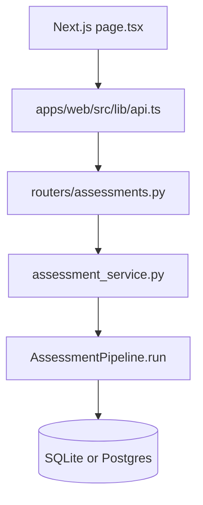
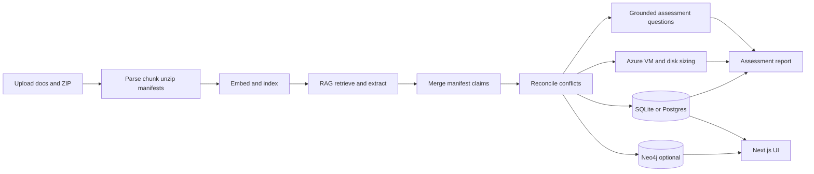
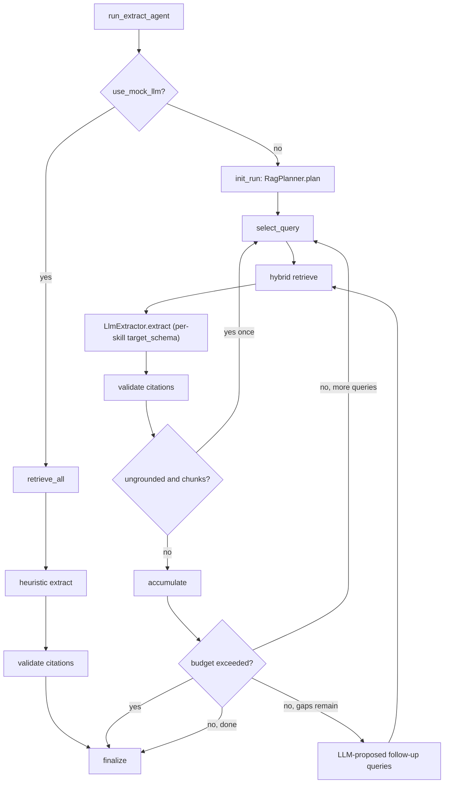

# Architecture

Cloud Migration Assessment Accelerator — how discovery data becomes a migration-ready, source-linked assessment.

Product intent: turn fragmented enterprise inputs into standardized, evidence-backed readiness outputs.

**Azure positioning:** This app can run as an **AI Landing Zone spoke workload**. See **[AI_LANDING_ZONE.md](AI_LANDING_ZONE.md)** for hub/spoke mapping, `APP_PROFILE=local|lz`, and Managed Identity.

Install and run: **[SETUP.md](SETUP.md)**. This document is the code map for a new developer.

**Dynamic vs. deterministic:** cognitive decisions (extraction, retrieval planning, document classification, supplementary questions) are model-backed with deterministic offline fallbacks; governance decisions (SKU selection, pricing, precedence, citation grounding) stay rule-based, unchanged, and auditable. See **[DYNAMIC_ARCHITECTURE.md](DYNAMIC_ARCHITECTURE.md)** for the deep dive on the model-backed layer specifically. The effective resolved mode for every flag below is always inspectable at runtime via `GET /health/config`.

## Start here (profiles and LLM)

| `APP_PROFILE` | Typical laptop / spoke | Chat LLM |
|---------------|------------------------|----------|
| `local` (default) | SQLite, sentence-transformers + **FAISS** | Off if `MOCK_LLM=true` **or** no chat provider is configured. On if `MOCK_LLM=false` **and** Azure OpenAI, or `LLM_PROVIDER=openai_compatible` + `OPENAI_BASE_URL`, is configured. |
| `lz` | Postgres, Azure embeddings + **Azure AI Search**, guardrails | Azure OpenAI required. |

When chat LLM is **on**, it may: extract claims from retrieved chunks, rewrite question answers from supplied facts, explain conflict notes, write a readiness summary, and explain a **already chosen** SKU.

When chat LLM is **off**, extraction uses heuristics; questions, conflict notes, and the summary stay templates.

The LLM **must not**: pick a VM/disk SKU, invent citations, or override document precedence. Those stay in [`sizing.py`](../apps/api/app/services/sizing.py), [`citations.py`](../apps/api/app/services/citations.py), and [`reconciliation.py`](../apps/api/app/services/reconciliation.py).

## How to read the code

Start at [`providers.py`](../apps/api/app/services/providers.py) (`build_pipeline_services`), then [`pipeline.py`](../apps/api/app/services/pipeline.py) (`AssessmentPipeline`).

| Step | Module | What it does |
|------|--------|----------------|
| Wire | `providers.py`, `ports.py` | Choose embedder, FAISS or Azure Search, `ChatCompleter`, graph sink |
| Ingest | `ingest.py`, `parsers.py`, `storage.py`, `code_manifests.py` | Parse docs/CSV/JSON/ZIP; chunk; extract manifests |
| Index | `embeddings.py`, `vector_indexes.py`, `search.py` | Embed + FAISS or Azure AI Search |
| Retrieve / extract | `agent_extract.py`, `heuristic_extract.py` / `llm_extractors.py`, `citations.py` | RAG queries → claims with quotes |
| Reconcile | `reconciliation.py` | Precedence, conflicts, materialize apps/servers/DBs; optional conflict prose |
| Questions | `assessment_questions.py` | Versioned answers from selected claims; optional LLM rewrite |
| Size | `sizing.py`, `pricing.py` | Catalog SKU + optional explanation |
| Report | `report.py`, `evidence.py` | Inventory, gaps, summary, evidence traces |
| HTTP / UI | `assessment_service.py`, `routers/assessments.py`, `apps/web` | Use cases vs HTTP; tabs |

Review lives in [`workflow.py`](../apps/api/app/services/workflow.py) (`ENFORCE_REVIEW` for Complete Review → Follow-up).

## Request path (HTTP to database)



1. Home [`apps/web/src/app/page.tsx`](../apps/web/src/app/page.tsx) posts multipart `name` + `files` via [`api.ts`](../apps/web/src/lib/api.ts).
2. [`routers/assessments.py`](../apps/api/app/routers/assessments.py) calls `assessment_service.create_assessment`, which saves uploads and starts [`run_pipeline`](../apps/api/app/services/pipeline.py) on a **background thread** (lock in [`pipeline_lock.py`](../apps/api/app/services/pipeline_lock.py) so one run per assessment — in-process by default, or a DB-row lock safe across multiple workers when `PIPELINE_LOCK_BACKEND=db`, required in `lz`).
3. The detail page polls `GET /assessments/{id}` until `status` is `completed` or `failed`.
4. Each tab then calls a read API (questions, claims, recommendations, graph, report, conflicts). Routers stay thin: HTTP + schema. Business logic lives in `assessment_service` and the service modules.

`GET /health` in [`main.py`](../apps/api/app/main.py) reports `embeddings`, `vector_index`, `mock_llm`, and `neo4j`.

## High-level product flow



## Components

| Component       | Path                                        | Role                                                      |
| --------------- | ------------------------------------------- | --------------------------------------------------------- |
| API             | `apps/api`                                  | FastAPI, pipeline, RAG, questions, sizing, Neo4j sync     |
| UI              | `apps/web`                                  | Create, questions, sizing, findings, graph, report, review |
| Operational DB  | SQLite (default) or Postgres                | Assessments, documents, chunks, claims, conflicts, recs, report |
| Vector index    | `data/embeddings/*.faiss` (+ `.meta.json`) or Azure AI Search | Chunk retrieval for RAG |
| Knowledge graph | Neo4j (optional)                            | Apps/servers/DBs/interfaces + relationships               |
| Sample pack     | `sample-data/`                              | Contoso demo estate                                       |

## Pipeline stages (functions)

Orchestrated in [`AssessmentPipeline._execute`](../apps/api/app/services/pipeline.py). `PipelineServices` (built in `providers.py`) injects embedder, vector indexes, graph sink, and claim extractor.

| Status (`PipelineStatus`) | What runs | Workflow (`WorkflowStage`) |
|---------------------------|-----------|----------------------------|
| `ingesting` | `clear_derived` → `ingest_documents` | `research` |
| (same run) | `ChunkIndexer.embed_and_index` | |
| `extracting` | `extractor.extract_assessment` → merge ZIP manifest extractions | `implement` |
| `reconciling` | `persist_extraction` | |
| `building_graph` | `graph.sync` | |
| `generating_report` | `generate_recommendations` → `generate_report` | `review` |
| `completed` / `failed` | metrics written; exception → `error_message` | |

1. **Ingest** — [`ingest.py`](../apps/api/app/services/ingest.py): parse PDF/DOCX/XLSX/CSV/JSON/TXT; ZIP → safe extract + manifests. Unreadable files become gaps; they do not fail the assessment.
2. **Index** — local MiniLM + **FAISS**, or Azure embeddings + **Azure AI Search** (`lz` / `LOCAL_EMBEDDINGS=false`).
3. **Extract** — LangGraph RAG (see below); merge code-manifest claims.
4. **Reconcile** — document precedence + confidence; open conflicts; optional LLM notes.
5. **Graph** — `GraphSink` (Neo4j when up, otherwise no-op).
6. **Report** — questions, sizing, readiness summary, gaps, inventory JSON.

- **Review gate** (`ENFORCE_REVIEW`): `POST /assessments/{id}/complete-review` requires an empty review queue and no open conflicts, then advances to **Follow-up**.
- **Follow-up**: rejects/overrides and notes append to `metrics.follow_up_log`.

## Two extract graphs

[`extraction.py`](../apps/api/app/services/extraction.py) `AssessmentClaimExtractor` calls [`run_extract_agent`](../apps/api/app/services/agent_extract.py). Retriever is `MergingRetriever` — hybrid BM25 + vector search fused via Reciprocal Rank Fusion — in [`search.py`](../apps/api/app/services/search.py) (falls back to a simple waterfall merge if `RETRIEVAL_HYBRID_ENABLED=false` or `rank_bm25` isn't installed).



- **Mock / offline** (`use_mock_llm`): `retrieve_all → heuristic extract → validate → finalize`. Mode metric: `langgraph_heuristic_rag`.
- **Chat LLM**: `init_run` resolves the query list via the configured `RagPlanner` (`HeuristicPlanner`, the default, filters `skills.SKILLS` by a per-skill doc-type gate; `RAG_PLANNER=off` reproduces the old fixed-11-query sweep). For each resolved query: `select_query → retrieve → extract → validate → optional citation retry → accumulate → check_budget`. The `extract` node passes the active skill's `target_schema`/`system_prompt` (see `skills.py`) through to `LlmExtractor.extract` for structured, schema-constrained output. `check_budget` (bounded by `AGENT_MAX_LLM_CALLS`/`AGENT_WALL_CLOCK_SECONDS`) can finalize the run early with whatever was accumulated. If gaps remain after the sweep, the configured chat LLM is asked for multiple targeted follow-up queries (falls back to one templated [`extra_gap_query`](../apps/api/app/services/agent_extract.py) when unavailable). Mode: `langgraph_llm_rag`. `recursion_limit=250` remains a hard backstop underneath the budget breaker.

Citation grounding: [`citations.py`](../apps/api/app/services/citations.py). Guardrails wrap extract: [`guardrails.py`](../apps/api/app/services/guardrails.py) (empty chunks, `InjectionDetector` chain, optional Azure Content Safety, output allowlists, PII redaction). Then citations again.

ZIP manifests, reconcile, sizing, Neo4j, report, and review stay **outside** LangGraph.

Chunking is structure-aware and routed by document type (row-group for CMDB/inventory, Q/A-pair for questionnaires, bounded token windows per manifest file for code snapshots, table-aware prose splitting for architecture/requirements docs) — see [`chunkers.py`](../apps/api/app/services/chunkers.py). Inventory, requirements, and code-snapshot chunks are additionally boosted into the mock-path retrieval set.

Every tabular chunk path (whole-sheet CMDB tables and tables embedded inside a DOCX) shares the same table handling:

- **Shape guard** (`check_table_shape`) — before row-grouping a table, checks the data rows against the header's column count (flags a >10% mismatch) and scans for a hidden second header row (a non-numeric row sitting among otherwise-numeric rows, e.g. a re-stated header mid-sheet). A table that fails the guard falls back to plain prose chunks tagged `shape_guard_failed`/`shape_guard_reason` instead of being silently mis-row-grouped; `ingest.py` surfaces each failure as a gap in the report ("irregularly-shaped table — verify manually").
- **Table-summary chunk** (`_build_table_summary`) — for tables with recognized numeric columns (vCPU, memory, storage, etc., via the same `_canonical_header` alias table `heuristic_extract` uses), a single computed chunk (sum/avg/min/max/count) is added alongside the row-group chunks, tagged `metadata.kind == "table_summary"`. This gives retrieval one authoritative answer for "what's the total X across all servers" instead of relying on the LLM to re-sum row-group chunks itself.
- **DOCX embedded tables** — `parsers._parse_docx` walks the document body in true document order (`_iter_docx_blocks`, interleaving paragraphs and tables as they actually appear, since `document.paragraphs`/`document.tables` each only return one type and lose relative order) and wraps each table in `<<TABLE>>...<<END_TABLE>>` sentinel markers, keeping empty cells so column position isn't lost. `chunkers.chunk_prose_with_tables` (the default prose-path chunker) splits on those markers and routes table segments through the same shape-guard/summary/row-group logic as a whole-sheet inventory table (tagged `embedded_table: true`), while prose segments go through normal paragraph packing — both in original document order.

### Guardrail flags

| Env                                 | Default | Effect                                                          |
| ------------------------------------ | ------- | ---------------------------------------------------------------- |
| `GUARDRAILS_ENABLED`                | true    | Master switch                                                   |
| `GUARDRAILS_BLOCK_ON_INJECTION`     | true    | Block extract on injection patterns (else sanitize and continue) |
| `GUARDRAILS_BLOCK_ON_HARM`          | true    | Block on offline harm / Azure Content Safety hits                |
| `GUARDRAILS_SEMANTIC_CHECK_ENABLED` | false   | Layer an LLM injection classifier on top of the regex scan (`CompositeInjectionDetector`) |
| `PII_REDACTION_MODE`                | regex   | `regex` \| `off` — redact emails/IPs/phone numbers from claim values/quotes and prose |
| `CONTENT_SAFETY_FAIL_OPEN`          | true    | `false` required in `lz` — a Content Safety call error blocks instead of silently continuing |
| `AZURE_CONTENT_SAFETY_`*            | empty   | Optional Azure AI Content Safety analyze                         |

## Chat vs rules (ports)

Composition root: [`providers.py`](../apps/api/app/services/providers.py). Protocols: [`ports.py`](../apps/api/app/services/ports.py).

| Port | Implementations | Role |
|------|-----------------|------|
| `Embedder` | `SentenceTransformerEmbedder`, `AzureEmbedder` (+ `FallbackEmbedder` in lz) | Vectors |
| `VectorIndex` | `FaissVectorIndex`, `AzureSearchIndex` | Persist / kNN |
| `Retriever` | `MergingRetriever` (BM25 + vector, RRF-fused) | Chunks for a query |
| `Chunker` | `DocumentChunker` (routes by doc type) | Structure-aware chunking (see [`chunkers.py`](../apps/api/app/services/chunkers.py)) |
| `ChatCompleter` | `OpenAICompatibleCompleter` (Azure OpenAI or any OpenAI-compatible endpoint via `LLM_PROVIDER=openai_compatible`), `DisabledChatCompleter` | Chat completions, with retry/backoff on transient errors |
| `LlmExtractor` | `ChatLlmExtractor` (structured, per-skill schemas), `HeuristicLlmExtractor`, `EnsembleExtractor` | Query + chunks → `ExtractionResult` |
| `ClaimExtractor` | `AssessmentClaimExtractor` | Whole-assessment extract |
| `RagPlanner` | `HeuristicPlanner`, `NoOpRagPlanner` | Which skills' queries to run for a corpus |
| `DocClassifier` | `KeywordClassifier`, `LlmClassifier` | Document type + confidence + rationale |
| `QuestionPlanner` | `HeuristicQuestionPlanner`, `LlmQuestionPlanner`, `NoOpQuestionPlanner` | Estate-specific supplementary questions |
| `InjectionDetector` | `RegexInjectionDetector`, `SemanticInjectionDetector`, `CompositeInjectionDetector` | Prompt-injection signal detection |
| `GraphSink` | `Neo4jGraphSink`, `NullGraphSink` | Optional Neo4j sync |

See [DYNAMIC_ARCHITECTURE.md](DYNAMIC_ARCHITECTURE.md) for how the last four ports fit together (each is model-backed with a deterministic fallback, selected in `providers.py`).

[`llm_clients.get_chat_completer`](../apps/api/app/services/llm_clients.py) is the only place that reads chat-provider config (`MOCK_LLM`, Azure OpenAI, or `LLM_PROVIDER=openai_compatible`). Domain code takes a `ChatCompleter` or `GroundedProse`.

[`GroundedProse`](../apps/api/app/services/llm_reasoning.py) (prompts in [`llm_prompts.py`](../apps/api/app/services/llm_prompts.py)):

- Question `answer` rewrite from facts + quotes (`answer_source`: `llm` or `template`)
- Conflict `resolution_notes` (winner already chosen)
- Readiness summary from counts/gaps

`supported` / `evidence_refs` stay derived from claims. If the completer is disabled or the call fails, templates are kept.

## Evidence traces

Chunk IDs on claims and answers are not enough for a human. [`evidence.py`](../apps/api/app/services/evidence.py) resolves them to `filename`, `doc_type`, `page`, and quote. The API attaches that list; the UI [`EvidenceTrace`](../apps/web/src/app/assessments/[id]/page.tsx) shows it on questions, findings, review, and the report appendix.

## Document types and precedence

The `PRECEDENCE` table is defined in [`parsers.py`](../apps/api/app/services/parsers.py) and is **fixed and rule-based**:

| Type            | Typical inputs        | Precedence    |
| --------------- | --------------------- | ------------- |
| `inventory`     | CMDB XLSX / CSV / JSON | 100 (highest) |
| `code_snapshot` | App ZIP               | 90            |
| `architecture`  | Architecture PDF/DOCX | 80            |
| `requirements`  | BRD / NFR / SLA packs | 70            |
| `runbook`       | Ops runbooks          | 60            |
| `questionnaire` | Assessment Q&A        | 40            |

When two claims disagree (e.g. server OS), higher precedence wins; losers are flagged for human review. The LLM may explain that choice; it does not pick the winner.

**Which label a document gets is dynamic; the table above is not.** [`ingest.py`](../apps/api/app/services/ingest.py) routes every non-`.zip` document through the configured `DocClassifier` (`DOC_CLASSIFIER=llm|keyword`, see [DYNAMIC_ARCHITECTURE.md](DYNAMIC_ARCHITECTURE.md)); below `DOC_CLASSIFY_REVIEW_THRESHOLD` the keyword-ladder guess is kept and a gap is added to the report instead of silently mislabeling. `Document.doc_type_confidence`/`doc_type_rationale` persist the classifier's reasoning.

## Data model

SQLAlchemy models: [`entities.py`](../apps/api/app/models/entities.py).

| Entity | Role |
|--------|------|
| `Assessment` | `status` (pipeline), `workflow_stage`, `metrics`, `error_message` |
| `Document` | File, `doc_type`, `doc_type_confidence`, `doc_type_rationale`, `precedence` |
| `Chunk` | Page/offset text used for RAG and citations; `metadata_json` (section title, row range, file path, etc. from structure-aware chunking) |
| `Claim` | One fact: entity/attribute/value, quotes, `is_selected`, review fields |
| `Conflict` | Competing claims + `selected_claim_id` + `resolution_notes` |
| `Application` / `Server` / `DatabaseEntity` / `Interface` | Materialized inventory |
| `DependencyEdge` | hosted_on / uses / calls / depends_on |
| `InfrastructureRecommendation` | Catalog SKU JSON per server |
| `AssessmentOutput` | Persisted report JSON + `readiness_summary` |
| `EngagementQuestion` | `origin`: `uploaded` \| `ad_hoc` \| `dynamic` (QuestionPlanner-generated) |
| `PipelineLockRow` | Used when `PIPELINE_LOCK_BACKEND=db` — one row per in-flight assessment, multi-worker-safe |

Claims materialize into inventory + edges (`persist_extraction`), then Neo4j when the sink is available.

Every extracted fact is a **claim**: `entity_type` / `entity_key` / `attribute` / `value`, `confidence`, `evidence_refs`, `evidence_quote`, `needs_human_review`, `unsupported`. Review actions: accept / override / reject.

## Code manifests

[`code_manifests.py`](../apps/api/app/services/code_manifests.py):

- Safe ZIP extract (zip-slip, size limits, skip `node_modules` / `.git`)
- Parse `package.json`, `pom.xml`, `requirements.txt`, Dockerfiles, compose, `appsettings`, `.env.example`, etc.
- Emit runtime/framework claims and infra deps (Postgres, Redis, Kafka, …) with file-path evidence
- Secrets: only key presence, values redacted

## Knowledge graph

[`neo4j_graph.py`](../apps/api/app/services/neo4j_graph.py) + [`graph.py`](../apps/api/app/services/graph.py):

**Labels:** Application, Server, Database, Interface, Document  
**Rels:** HOSTED_ON, USES, DEPENDS_ON, CALLS  

- Prefer Neo4j for `GET /assessments/{id}/graph` and blast-radius
- If Neo4j unavailable: build graph from SQLite/Postgres tables (BFS blast radius)
- Pipeline never fails solely because Neo4j is down

## API surface

Router: [`apps/api/app/routers/assessments.py`](../apps/api/app/routers/assessments.py). Use cases: [`assessment_service.py`](../apps/api/app/services/assessment_service.py).

| Method | Path | UI tab / use |
|--------|------|----------------|
| POST | `/assessments` | Home: create + upload (starts pipeline) |
| GET | `/assessments/{id}` | Overview: status + metrics |
| POST | `/assessments/{id}/run` | Re-run pipeline |
| GET | `/assessments/{id}/assessment-questions` | Questions |
| GET | `/assessments/{id}/recommendations` | Sizing |
| GET | `/assessments/{id}/claims` | Findings (`?review_only=true` for queue) |
| GET | `/assessments/{id}/entities` | Findings inventory |
| GET | `/assessments/{id}/conflicts` | Findings conflicts |
| POST | `/assessments/{id}/claims/{claim_id}/review` | Review |
| GET | `/assessments/{id}/graph` / `.../blast-radius` | Graph |
| GET | `/assessments/{id}/report` | Report |
| POST | `/assessments/{id}/complete-review` / `.../follow-up` | Overview / follow-up |

OpenAPI: `/docs` when the API is running.

## UI map

[`apps/web`](../apps/web): Next.js App Router. API base: `NEXT_PUBLIC_API_URL`. Client: [`apps/web/src/lib/api.ts`](../apps/web/src/lib/api.ts). Detail: [`assessments/[id]/page.tsx`](../apps/web/src/app/assessments/[id]/page.tsx).

| Tab | Shows |
|-----|--------|
| Overview | Status, documents, metrics, complete-review / follow-up |
| Questions | Versioned answers, `answer_source`, evidence traces |
| Sizing | VM/disk, estimates, assumptions, explanation source |
| Findings | Entities, claims, conflicts (`resolution_notes`) |
| Graph | React Flow + blast radius |
| Report | Readiness summary, gaps, JSON export, evidence appendix |
| Review | Accept / override / reject |

## Data on disk (local demo)

```
data/
  cmaa.db              # SQLite (if used)
  uploads/{assessment}/
  embeddings/{assessment}.faiss
  embeddings/{assessment}.meta.json
  uploads/{assessment}/code/{document_id}/   # extracted ZIP trees
```

## Design principles

1. **Evidence-first** — claims need valid chunk refs **and** a grounded `evidence_quote` (substring of cited chunks); otherwise down-scored / cleared
2. **Degrade gracefully** — mock LLM, local embeddings, no Neo4j still produce a full demo
3. **Single claim schema** — docs, NFRs, and manifests reconcile into one model
4. **Human-in-the-loop** — conflicts and low confidence go to the review queue; clear the queue before Follow-up (`ENFORCE_REVIEW`); learnings in `metrics.follow_up_log`
5. **Ports** — `Embedder` / `VectorIndex` / `Retriever` / `Chunker` / `ChatCompleter` / `LlmExtractor` / `ClaimExtractor` / `RagPlanner` / `DocClassifier` / `QuestionPlanner` / `InjectionDetector` / `GraphSink`; composition root [`providers.py`](../apps/api/app/services/providers.py)
6. **Rules over generation** for SKU, citations, and precedence winners

## Module layout (API services)

| Area | Modules |
|------|---------|
| Orchestration | `pipeline.py` (`PipelineServices`), `ingest.py`, `workflow.py`, `assessment_service.py`, `pipeline_lock.py` |
| Ingest | `parsers.py`, `chunkers.py`, `storage.py`, `code_manifests.py`, `manifest_parsers/`*, `classify.py` |
| RAG | `embeddings.py`, `vector_indexes.py`, `search.py`, `extraction.py`, `agent_extract.py`, `skills.py`, `heuristic_extract.py`, `extraction_strategies.py`, `citations.py`, `guardrails.py`, `question_planning.py` |
| Chat / prose | `llm_clients.py`, `llm_prompts.py`, `llm_extractors.py`, `llm_reasoning.py`, `compat.py` |
| Ports | `ports.py`, `providers.py`, `schemas/extraction_targets.py`, `schemas/planning.py`, `schemas/classification.py`, `schemas/questions.py`, `schemas/guardrail_signals.py` |
| Outputs | `reconciliation.py`, `assessment_questions.py`, `sizing.py`, `pricing.py`, `report.py`, `evidence.py` |
| Graph | `graph.py`, `neo4j_graph.py`, `graph_sinks.py` |

See [DYNAMIC_ARCHITECTURE.md](DYNAMIC_ARCHITECTURE.md) for what each of the newer RAG/ports modules (`skills.py`, `classify.py`, `question_planning.py`, `extraction_strategies.py`, `schemas/extraction_targets.py`) actually does.

## Core capability coverage

### AI-assisted application assessment

- PDF, DOCX, XLSX, CSV, JSON, text, vendor documents, runbooks, questionnaires, requirements, and ZIP manifests feed one normalized claim model.
- LangGraph retrieval and extraction require chunk IDs and source quotes; unsupported outputs are cleared or sent to review.
- `assessment_questions.py` answers a versioned migration-readiness question set from selected claims and dependency edges (optional LLM prose).
- Report JSON exposes inventory, dependencies, assessment answers, evidence, gaps, and human-review state.

### Infrastructure sizing and recommendation

- Inventory columns normalize vCPU, RAM, utilization, disk capacity/IOPS/throughput, OS, architecture, environment, and region.
- `sizing.py` applies deterministic headroom, compatibility, VM, and disk rules against a versioned Azure catalog.
- Missing measurements use conservative assumptions that reduce confidence, are listed as assumed vs measured, and require review. Unsupported OS (AIX, Solaris, etc.) produces no SKU.
- `pricing.py` uses local estimates by default and can optionally query Azure Retail Prices; SKU selection remains deterministic.
- Azure OpenAI may explain a completed recommendation via `ChatCompleter`. It cannot change the SKU, assumptions, or price. Otherwise the explanation is the deterministic template.

## Related

- [SETUP.md](SETUP.md) — install and run
- [README.md](../README.md) — quick start and API table
- [DEMO.md](DEMO.md) — stakeholder UI walkthrough
- [DYNAMIC_ARCHITECTURE.md](DYNAMIC_ARCHITECTURE.md) — model-backed extraction/planning/classification/questions/guardrails, deep dive
- [AI_LANDING_ZONE.md](AI_LANDING_ZONE.md) — spoke profile
