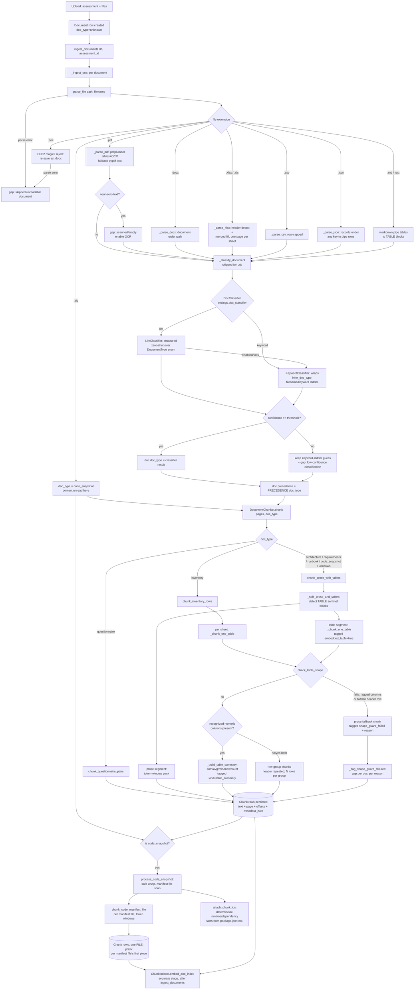

# Ingestion & Chunking Architecture

Status: reflects the implemented pipeline as of 2026-09-24. Companion to
[ARCHITECTURE.md](ARCHITECTURE.md) (system-wide) and
[DYNAMIC_ARCHITECTURE.md](DYNAMIC_ARCHITECTURE.md) (model-backed ports).

## Scope

Everything between "a file lands in `storage_dir`" and "a row exists in the
`chunks` table, ready for embedding/retrieval." Extraction, reconciliation,
sizing, and reporting are out of scope — see `ARCHITECTURE.md`.

## End-to-end flow

## Stage-by-stage

### 1. Parsing (`parsers.py`)

`parse_file(path, filename)` dispatches on extension and returns a
`ParseResult` (`pages: list[ParsedPage]`, `doc_type`, `page_count`, `summary`).
A parse failure is caught in `_ingest_one` and turned into a report gap —
the document row survives with no chunks rather than aborting the whole
ingest run.

| Extension | Parser | Notes |
|---|---|---|
| `.zip` | inline in `parse_file` | Content is *not* read here — just a placeholder page; real unzip/scan happens later, only if `doc_type == code_snapshot` |
| `.pdf` | `_parse_pdf` | Prefers `pdfplumber` (structured tables → `<<TABLE>>` blocks, borderless-table recovery, multi-column reading order, OCR-able page images); falls back to `pypdf` per-page text when pdfplumber is absent. See "PDF robustness" below |
| `.docx` | `_parse_docx` | See "DOCX document-order walk" below |
| `.doc` | rejected in `parse_file` | A true OLE2 binary `.doc` (sniffed by magic bytes) can't be read by `python-docx`; raises a clear "re-save as .docx" error rather than an opaque failure. A `.docx` mislabeled `.doc` still parses |
| `.xlsx`/`.xls`/`.xlsm` | `_parse_xlsx` | One `ParsedPage` per sheet, `# Sheet: <name>` header, rows pipe-joined. Detects the real header row under a title/blank band. Files ≤ `XLSX_FULL_LOAD_MAX_MB` are loaded fully so **merged data cells** expand correctly; larger files stream read-only (merged headers forward-filled only). Row-capped (`MAX_ROWS_PER_SHEET`) |
| `.csv` | `_parse_csv` | Single page, rows pipe-joined, row-capped (`MAX_ROWS_PER_SHEET`) |
| `.json` | `_parse_json` | Finds the list-of-records under *any* top-level key (not just `servers`), searched one level deep → header + pipe rows (so it flows through the same inventory-row chunker as a spreadsheet); anything else → pretty-printed JSON as prose |
| `.md`/`.markdown` and any other text | else-branch | UTF-8 (BOM-tolerant, never raises on a bad byte); GitHub-style pipe tables are rewritten to `<<TABLE>>` blocks so they chunk structurally |

**Parsing robustness guardrails.** Every path is designed so an unusual
document degrades to a *visible gap* rather than silent data loss, an OOM, or a
runaway chunk count. `ParseResult.warnings` carries non-fatal issues, which
`_ingest_one` turns into report gaps (same mechanism as the shape guard):

- **Empty / scanned detection** (`_flag_empty_extraction`) — a document that
  parses "successfully" but yields fewer than `MIN_CHARS_PER_PAGE` chars/page
  (the classic image-only PDF, or a corrupt file) is flagged instead of
  silently contributing zero chunks.
- **PDF robustness** (`_parse_pdf`) — with `pdfplumber` installed and
  `PDF_TABLE_EXTRACTION` on, each page's tables are pulled out as `<<TABLE>>`
  blocks (so inventory-in-PDF gets the same row/summary chunking a spreadsheet
  does) and prose is taken from the non-table regions. Three further refinements
  layer on top:
    - **Borderless tables** (`_find_tables_robust`, `PDF_BORDERLESS_TABLES`, **off by
      default**) — after the low-false-positive line-ruled pass finds nothing, an opt-in
      text-alignment retry catches whitespace-aligned tables, each validated by
      `_looks_like_table` (≥2 rows, ≥3 columns, majority sharing the modal width). It is
      off by default because pdfplumber's text strategy is aggressive — it will carve
      ordinary or two-column prose into a fake grid (even splitting words mid-token), and
      prose PDFs are far more common than borderless-table PDFs. Line-ruled detection is
      always on.
    - **Multi-column reading order** (`_extract_text_reading_order`) — a clean,
      word-free vertical gutter splitting the page into two balanced groups
      (`_detect_column_boundary`) triggers column-by-column reflow (left fully, then
      right) instead of `extract_text`'s scan-line interleaving; single-column pages
      are never reflowed.
    - **OCR** — when a page is otherwise empty and `OCR_ENABLED` is set, the rendered
      page image is OCR'd via the optional `pytesseract` (`uv sync --extra ocr`) +
      system `tesseract` binary.
  Every optional piece is a soft import: a missing library degrades (pdfplumber →
  `pypdf`; no tesseract → the empty-extraction gap) and never fails ingest.
- **Resource caps** — `MAX_FILE_MB` (checked before load), `MAX_PAGES_PER_DOC`,
  `MAX_ROWS_PER_SHEET`, and `MAX_CHUNKS_PER_DOC` (enforced in `ingest._cap_chunks`).
  Exceeding one truncates with a surfaced gap.

**DOCX document-order walk.** `_parse_docx` does not use
`document.paragraphs` / `document.tables` — each only returns one element
type, so any table's position relative to surrounding prose is lost.
Instead `_iter_docx_blocks` walks `document.element.body.iterchildren()`
directly, yielding `Paragraph`/`Table` objects in true document order, and
wraps each table's rows in `<<TABLE>>...<<END_TABLE>>` sentinel markers
(`TABLE_BLOCK_START`/`TABLE_BLOCK_END`). Table cells are kept even when
empty (`" | ".join(cells)` over every cell, not just non-empty ones) —
dropping a blank cell would shift every later column out of position.

`infer_doc_type(filename, text_sample)` (the keyword ladder used as the
`KeywordClassifier`'s implementation and the fallback baseline for
everything) runs after parsing, on the first ~2000 chars of joined page
text plus the filename.

### 2. Classification (`ingest._classify_document`, `classify.py`)

Skipped for `.zip` (extension alone is unambiguous — asking a model would
burn a call for zero decision value). For everything else, the configured
`DocClassifier` (`settings.doc_classifier: "llm" | "keyword"`) is called
with the filename and a 1500-char text sample:

- **`KeywordClassifier`** — wraps `infer_doc_type` unchanged; confidence is
  graded by match specificity (strong filename/extension match ≈0.9,
  content-keyword fallback ≈0.6, no signal ≈0.4).
- **`LlmClassifier`** — structured zero-shot classification over the fixed
  `DocumentType` enum (excluding `code_snapshot`, which is never a valid
  content-based answer here); falls back to `KeywordClassifier` on a
  disabled completer, a failed call, or a `code_snapshot` answer (which
  would incorrectly make `_ingest_one` try to unzip a non-ZIP file).

The classifier's `doc_type` is only *applied* when its `confidence >=
settings.doc_classify_review_threshold` (default 0.6); below that, the
keyword-ladder guess is kept and a gap is appended
(`"classified as X with low confidence... verify document type"`) —
visible uncertainty rather than a silent wrong guess. Either way,
`PRECEDENCE[doc_type]` (the fixed, non-model-driven precedence table used
by reconciliation) is looked up from whatever `doc.doc_type` ends up being.

### 3. Chunking (`chunkers.py`)

`DocumentChunker.chunk(pages, doc_type, filename)` routes by `doc_type`:

| `doc_type` | Strategy | Shape |
|---|---|---|
| `inventory` | `chunk_inventory_rows` | Per-sheet: shape guard → summary chunk (if numeric columns) + row-groups, or prose fallback |
| `questionnaire` | `chunk_questionnaire_pairs` | Split on `Q:`/numbered-question boundaries, one chunk per Q/A pair |
| everything else (`architecture`, `requirements`, `runbook`, `code_snapshot` prose, `unknown`) | `chunk_prose_with_tables` | Table-sentinel-aware prose splitting (below) |

Code-snapshot *manifest files* (inside a ZIP) don't go through
`DocumentChunker` at all — they're chunked separately per-file by
`chunk_code_manifest_file`, after `_ingest_code_snapshot` runs
`process_code_snapshot` to safely unzip and enumerate manifests.

**Shared table logic** (`_chunk_one_table`), used by both `chunk_inventory_rows`
(whole-sheet tables) and `chunk_prose_with_tables` (tables embedded in a
DOCX's prose):

1. **Shape guard** (`check_table_shape`) — rejects a table before
   row-grouping it if either:
   - more than 10% of data rows have a different field count than the
     header (`_looks_like_header`/column-count check), or
   - a data row looks like a second, hidden header (mostly non-numeric
     cells sitting among otherwise-numeric rows).

   A failing table falls back to plain prose chunks tagged
   `shape_guard_failed: true` / `shape_guard_reason: "..."` instead of
   being silently mis-row-grouped. `ingest._flag_shape_guard_failures`
   turns every distinct failure reason into a report gap ("irregularly
   shaped table — verify manually").

2. **Table-summary chunk** (`_build_table_summary`) — if the header maps
   any column to a recognized numeric field (vCPU, memory, storage, etc.,
   via the same `_canonical_header` alias table `heuristic_extract` uses
   for CMDB column normalization), one extra chunk is emitted with
   computed `sum`/`avg`/`min`/`max`/`count` per numeric field, tagged
   `metadata.kind == "table_summary"`. This gives retrieval a single
   authoritative answer for "what's the total X across all servers"
   instead of depending on the LLM to re-sum several row-group chunks
   itself.

3. **Row-group chunks** (`_group_rows_adaptively`) — rows are grouped by a
   **token budget** (`chunk_size_tokens`), capped by `rows_per_chunk`
   (`settings.chunk_inventory_rows`) as an upper bound, not a fixed row
   count alone. A table of long rows (e.g. a free-text notes column) gets
   more, smaller groups instead of blowing past a reasonable chunk size;
   a table of short rows still stops at `rows_per_chunk` per group so a
   row-range citation stays a practical size to point someone at. The
   header line is repeated at the top of each group, tagged with
   `row_range: [start, end]`.

**`chunk_prose_with_tables`** (the default for non-inventory,
non-questionnaire docs): `_split_prose_and_tables` scans the parsed text
for `<<TABLE>>...<<END_TABLE>>` sentinel blocks (written by `_parse_docx`)
and splits it into an ordered list of `(_ProseSegment | _TableSegment,
start_offset)` pairs. Prose segments are packed into token windows
(`chunk_size_tokens`/`chunk_overlap_tokens`) via the span-aware packer;
table segments are routed through `_chunk_one_table` and tagged
`embedded_table: true`. Both segment types are emitted **in original
document order** — a table in the middle of an architecture doc doesn't get
shoved to the end of the chunk list.

**Real source offsets + prose overlap.** The prose path
(`chunk_prose_recursive` and prose segments of `chunk_prose_with_tables`)
packs *paragraph spans* (`_paragraph_spans` → `_pack_spans`), so each chunk's
`offset_start`/`offset_end` are genuine character positions in the source page
(a chunk can be located/highlighted back in the original), not a running length
counter. `_apply_prose_overlap` then prepends each chunk (after the first) with
the trailing sentences (~`chunk_overlap_tokens`) of the previous chunk, so a
fact spanning a paragraph boundary survives in at least one chunk; the offset
start is pulled back to reflect the carried region. (Table/manifest chunks still
use synthetic within-segment offsets — their citations key off `row_range` /
`file_path` metadata, not offsets.)

**Oversized-paragraph splitting** (`_window_by_tokens`) tries sentence
boundaries first: a paragraph that's too long for one chunk is split into
sentences (`_split_sentences`, which also breaks on CJK terminators
`。！？；` that carry no trailing whitespace) and those are token-packed via
the same `_pack_blocks` greedy packer, so a chunk boundary lands after a
sentence end rather than at an arbitrary token offset. Only a single run-on
block with no sentence punctuation at all (a pathological case) still falls
back to a raw token/char cut (`_raw_token_window`).

**Context annotation** (`_annotate_with_context`, run once per document
at the end of `DocumentChunker.chunk()`) tags every piece's metadata with
two distinct signals, addressing a chunk's biggest weakness on its own —
no idea where in the document it came from once it's retrieved in
isolation:

- `section_title` — a short breadcrumb built **only** from doc-type and
  structural metadata (`"architecture — rows 21-40"`, `"inventory —
  question 3"`, `"architecture — part 4 of 9"`), never from raw document
  content or the filename (which is user-controlled). Because it can't
  carry anything an uploaded file influenced, it's safe to send straight
  to the LLM extraction prompt without injection scanning of its own —
  `chunks_to_payload` forwards it and `llm_extractors._spotlight_chunks`
  renders it as a leading line inside the `<chunk>` fence.
- `embed_context` — for a plain-prose piece only (one with no row-range/
  Q&A/manifest/summary anchor of its own), a short tail snippet of the
  *previous* plain-prose piece's own text. This **is** raw document
  content, so it's retrieval-only: `search.chunk_search_text` folds it
  into what's actually embedded/indexed (FAISS/Azure Search vectors,
  BM25, and the naive keyword fallback all route through it), but it's
  never forwarded into the LLM-facing payload and `Chunk.text` itself is
  never modified — citation-quote validation keeps checking evidence
  against the original, unmodified text. This is what lets a chunk like
  *"the above servers are production-critical"* still be found by a query
  naming the actual servers, without widening what untrusted content
  reaches the model.

**Parent-child chunking** (`heuristic_extract.chunks_to_payload`, run at
payload-build time — i.e. per retrieval, not per document like the two
signals above) is the extraction-side counterpart to `embed_context`:
retrieval still matches on the precise (child) chunk, but each retrieved
chunk's payload additionally gets a `parent_context` — a bounded window
(`PARENT_CONTEXT_RADIUS` chunk_index positions either side, capped at
`PARENT_CONTEXT_MAX_CHARS`, default settings both on) of its *same-document*
neighbors, fetched in one batched query (`_fetch_sibling_map`) across the
whole retrieved set rather than one query per chunk. Unlike `embed_context`,
this **is** shown to the LLM — `llm_extractors._spotlight_chunks` renders it
inside the `<chunk>` fence, explicitly labeled "for interpretation only,"
and it goes through the identical `_neutralize_nested_tags` fence-escape and
`guardrails.guard_extract_input` injection scan/sanitize as the chunk's own
`text` (extending both, since this is a second surface of raw document
content reaching the prompt). It never gets its own `chunk_id` in the
payload, so `citations.validate_citations` still only ever grounds a quote
against the *child* chunk's own `text` — parent context can help the model
correctly interpret a dangling reference, but can never itself become the
cited evidence.

### 4. Persistence

Each `ChunkPiece` (`page`, `offset_start`, `offset_end`, `text`, `metadata`)
becomes a `Chunk` row (`chunk_index`, `page`, `offset_start`, `offset_end`,
`text`, `metadata_json`). Chunk embedding/indexing
(`ChunkIndexer.embed_and_index`) is a separate stage that runs after all
documents in the assessment have been ingested — not covered here, see
`ARCHITECTURE.md`'s retrieval section.

### 5. Code snapshots (ZIP) — a parallel path

`_ingest_one` always creates the placeholder chunk(s) from `parse_file`
first, then — only if `doc.doc_type == code_snapshot` or the filename ends
in `.zip` — calls `_ingest_code_snapshot`, which:

1. `process_code_snapshot` — safely unzips (path-traversal/zip-bomb guarded,
   see `code_manifests.py`) and locates manifest files (`package.json`,
   `requirements.txt`, `*.csproj`, etc.).
2. Each manifest file is chunked independently by
   `chunk_code_manifest_file(relative_path, text, size_tokens,
   overlap_tokens)` — only the *first* piece of a given file is prefixed
   with `# FILE: <path>`, so a large manifest split across multiple chunks
   doesn't repeat the header.
3. `attach_chunk_ids` links the deterministic runtime/dependency facts
   already extracted by the manifest parsers (e.g. `node` runtime from
   `package.json`, `postgres`/`redis`/`kafka` deps) back to the specific
   chunk IDs that produced them, so those claims carry real evidence
   citations without needing an LLM call.

## Failure modes surfaced as report gaps (not silent)

| Condition | Where | Gap text pattern |
|---|---|---|
| File can't be parsed at all (incl. legacy `.doc`, oversized file, invalid JSON) | `_ingest_one` | `"Skipped unreadable document <file>: <error>"` |
| Scanned / empty document (≈no extractable text) | `_flag_empty_extraction` → `_ingest_one` | `"'<file>' produced almost no extractable text (...); it looks scanned or image-only ..."` |
| Page/row truncated at a resource cap | `_enforce_page_cap` / `_parse_xlsx` / `_parse_csv` | `"'<file>' has N pages; only the first M were ingested ..."` |
| Chunk count over `MAX_CHUNKS_PER_DOC` | `_cap_chunks` | `"'<file>' produced N chunks, over the M limit ...; only the first M were ingested"` |
| Classifier confidence below threshold | `_classify_document` | `"Document '<file>' classified as <type> with low confidence (...)"` |
| Table shape guard failed | `_flag_shape_guard_failures` | `"'<file>' has an irregularly-shaped table (<reason>); row-level extraction was skipped for it — verify manually."` |
| Code snapshot processing failed | `_ingest_code_snapshot` | `"Failed to process code snapshot <file>: <error>"` |

## Key files

| File | Role |
|---|---|
| [`ingest.py`](../apps/api/app/services/ingest.py) | Orchestrates parse → classify → chunk → persist per document; gap surfacing |
| [`parsers.py`](../apps/api/app/services/parsers.py) | Format-specific parsing; DOCX document-order walk; `infer_doc_type` keyword ladder; `PRECEDENCE` table |
| [`chunkers.py`](../apps/api/app/services/chunkers.py) | All chunking strategies; shape guard; table summary; adaptive row grouping; sentence-aware oversized-block splitting; context annotation; `DocumentChunker` router |
| [`classify.py`](../apps/api/app/services/classify.py) | `DocClassifier` implementations (`KeywordClassifier`, `LlmClassifier`) |
| [`code_manifests.py`](../apps/api/app/services/code_manifests.py) | Safe ZIP extraction, manifest file discovery, deterministic dependency parsing |
| [`heuristic_extract.py`](../apps/api/app/services/heuristic_extract.py) | `_canonical_header` alias table shared with the table-summary builder; `chunks_to_payload` forwards `section_title`, builds `parent_context` (parent-child chunking) via batched sibling lookup |
| [`search.py`](../apps/api/app/services/search.py) | `chunk_search_text` folds `embed_context` into what's embedded/indexed, without touching `Chunk.text` |
| [`llm_extractors.py`](../apps/api/app/services/llm_extractors.py) | `_spotlight_chunks` renders `section_title` and `parent_context` inside the fenced `<chunk>` block sent to the LLM |
| [`guardrails.py`](../apps/api/app/services/guardrails.py) | `guard_extract_input` scans/sanitizes `parent_context` identically to chunk `text` |

## Tests

| Test file | Covers |
|---|---|
| [`test_chunkers.py`](../apps/api/tests/test_chunkers.py) | Row-grouping (adaptive token budget + row-count cap), summary aggregates, shape guard (ragged columns, hidden header), sentence-aware oversized-paragraph splitting, `section_title`/`embed_context` annotation, Q/A splitting, manifest-file chunking, doc-type routing |
| [`test_parsing_robustness.py`](../apps/api/tests/test_parsing_robustness.py) | Empty/scanned-PDF gap, legacy `.doc` rejection, markdown-table conversion, generalized JSON record discovery, XLSX header detection + merged **data**-cell expansion + preamble folding, resource caps (file size / page / CSV row), PDF table extraction + OCR fallback (faked) **and a real reportlab-built PDF through live pdfplumber**, borderless-table recovery + validator, multi-column reading-order detection/reflow, CJK + Devanagari/Arabic sentence splitting, real prose offsets, prose overlap |
| [`test_docx_tables.py`](../apps/api/tests/test_docx_tables.py) | DOCX document-order preservation, empty-cell alignment, embedded-table chunking + summary, embedded shape-guard fallback |
| [`test_local_rag.py`](../apps/api/tests/test_local_rag.py) | `chunk_search_text`; a dangling-reference prose chunk becoming retrievable via its `embed_context` lookback |
| [`test_llm_reasoning.py`](../apps/api/tests/test_llm_reasoning.py) | `_spotlight_chunks` renders `section_title` and `parent_context`, neutralizes injection-like content in both |
| [`test_heuristic_extract.py`](../apps/api/tests/test_heuristic_extract.py) | `chunks_to_payload` forwards `section_title`; parent-child sibling lookup (radius, cross-document exclusion, `db`-optional backward compat, `PARENT_CONTEXT_ENABLED` toggle) |
| [`test_guardrails.py`](../apps/api/tests/test_guardrails.py) | `guard_extract_input` detects and sanitizes injection in `parent_context` the same as `text` |
| [`test_golden_extraction.py`](../apps/api/tests/test_golden_extraction.py) | End-to-end regression over real Contoso sample data, including a retrieval probe that a "total vCPU" query surfaces the computed `table_summary` chunk |
