# Ingestion & Chunking Architecture

Status: reflects the implemented pipeline as of 2026-09-23. Companion to
[ARCHITECTURE.md](ARCHITECTURE.md) (system-wide) and
[DYNAMIC_ARCHITECTURE.md](DYNAMIC_ARCHITECTURE.md) (model-backed ports).

## Scope

Everything between "a file lands in `storage_dir`" and "a row exists in the
`chunks` table, ready for embedding/retrieval." Extraction, reconciliation,
sizing, and reporting are out of scope — see `ARCHITECTURE.md`.

## End-to-end flow

```mermaid
flowchart TD
    upload[Upload: assessment + files] --> doc[Document row created<br/>doc_type=unknown]
    doc --> ingest[ingest_documents db, assessment_id]
    ingest --> one[_ingest_one, per document]

    one --> parse[parse_file path, filename]
    parse -->|parse error| gap1[gap: skipped unreadable document]
    parse --> ext{file extension}

    ext -->|.zip| zipType[doc_type = code_snapshot<br/>content unread here]
    ext -->|.pdf| pdfParse[_parse_pdf: pypdf per-page text]
    ext -->|.docx / .doc| docxParse[_parse_docx: document-order walk]
    ext -->|.xlsx / .xls| xlsxParse[_parse_xlsx: openpyxl, one page per sheet]
    ext -->|.csv| csvParse[_parse_csv]
    ext -->|.json| jsonParse[_parse_json: list of dicts to pipe rows]

    pdfParse --> classify
    docxParse --> classify
    xlsxParse --> classify
    csvParse --> classify
    jsonParse --> classify
    zipType --> chunk

    classify[_classify_document<br/>skipped for .zip] --> classifier{DocClassifier<br/>settings.doc_classifier}
    classifier -->|llm| llmClassify[LlmClassifier: structured<br/>zero-shot over DocumentType enum]
    classifier -->|keyword| kwClassify[KeywordClassifier: wraps<br/>infer_doc_type filename/keyword ladder]
    llmClassify -->|disabled/fails| kwClassify
    llmClassify --> conf{confidence >= threshold?}
    kwClassify --> conf
    conf -->|yes| applyType[doc.doc_type = classifier result]
    conf -->|no| keepType[keep keyword-ladder guess<br/>+ gap: low-confidence classification]
    applyType --> precedence
    keepType --> precedence

    precedence[doc.precedence = PRECEDENCE doc_type] --> chunk

    chunk[DocumentChunker.chunk pages, doc_type] --> route{doc_type}
    route -->|inventory| invChunk[chunk_inventory_rows]
    route -->|questionnaire| qaChunk[chunk_questionnaire_pairs]
    route -->|architecture / requirements / runbook / code_snapshot / unknown| proseChunk[chunk_prose_with_tables]

    invChunk --> shapeGuard1[per sheet: _chunk_one_table]
    proseChunk --> splitSeg[_split_prose_and_tables:<br/>detect TABLE sentinel blocks]
    splitSeg --> proseSeg[prose segment:<br/>token-window pack]
    splitSeg --> tableSeg[table segment: _chunk_one_table<br/>tagged embedded_table=true]

    shapeGuard1 --> shapeCheck{check_table_shape}
    tableSeg --> shapeCheck
    shapeCheck -->|fails: ragged columns<br/>or hidden header row| fallbackProse[prose fallback chunk<br/>tagged shape_guard_failed + reason]
    shapeCheck -->|ok| summaryDecide{recognized numeric<br/>columns present?}
    summaryDecide -->|yes| summaryChunk[_build_table_summary:<br/>sum/avg/min/max/count<br/>tagged kind=table_summary]
    summaryDecide -->|no/yes both| rowGroups[row-group chunks<br/>header repeated, N rows per group]

    fallbackProse --> gapFlag[_flag_shape_guard_failures:<br/>gap per doc, per reason]

    qaChunk --> persist
    proseSeg --> persist
    summaryChunk --> persist
    rowGroups --> persist
    gapFlag --> persist

    persist[(Chunk rows persisted<br/>text + page + offsets + metadata_json)]

    zipType --> codeSnap{is code_snapshot?}
    persist --> codeSnap
    codeSnap -->|yes| unzip[process_code_snapshot:<br/>safe unzip, manifest file scan]
    unzip --> manifestChunk[chunk_code_manifest_file<br/>per manifest file, token windows]
    manifestChunk --> persist2[(Chunk rows, one FILE: prefix<br/>per manifest file's first piece)]
    unzip --> manifestExtract[attach_chunk_ids:<br/>deterministic runtime/dependency<br/>facts from package.json etc.]

    persist2 --> index[ChunkIndexer.embed_and_index<br/>separate stage, after ingest_documents]
    persist --> index
```

## Stage-by-stage

### 1. Parsing (`parsers.py`)

`parse_file(path, filename)` dispatches on extension and returns a
`ParseResult` (`pages: list[ParsedPage]`, `doc_type`, `page_count`, `summary`).
A parse failure is caught in `_ingest_one` and turned into a report gap —
the document row survives with no chunks rather than aborting the whole
ingest run.

| Extension | Parser | Notes |
|---|---|---|
| `.zip` | inline in `parse_file` | Content is *not* read here — just a placeholder page; real unzip/scan happens later, only if `doc_type == code_snapshot` |
| `.pdf` | `_parse_pdf` | `pypdf`, one `ParsedPage` per page |
| `.docx`/`.doc` | `_parse_docx` | See "DOCX document-order walk" below |
| `.xlsx`/`.xls` | `_parse_xlsx` | `openpyxl`, one `ParsedPage` per sheet, `# Sheet: <name>` header, rows pipe-joined |
| `.csv` | `_parse_csv` | Single page, rows pipe-joined |
| `.json` | `_parse_json` | List of flat dicts → header + pipe rows (so it can flow through the same inventory-row chunker as a spreadsheet); anything else → pretty-printed JSON as prose |

**DOCX document-order walk.** `_parse_docx` does not use
`document.paragraphs` / `document.tables` — each only returns one element
type, so any table's position relative to surrounding prose is lost.
Instead `_iter_docx_blocks` walks `document.element.body.iterchildren()`
directly, yielding `Paragraph`/`Table` objects in true document order, and
wraps each table's rows in `<<TABLE>>...<<END_TABLE>>` sentinel markers
(`TABLE_BLOCK_START`/`TABLE_BLOCK_END`). Table cells are kept even when
empty (`" | ".join(cells)` over every cell, not just non-empty ones) —
dropping a blank cell would shift every later column out of position.

`infer_doc_type(filename, text_sample)` (the keyword ladder used as the
`KeywordClassifier`'s implementation and the fallback baseline for
everything) runs after parsing, on the first ~2000 chars of joined page
text plus the filename.

### 2. Classification (`ingest._classify_document`, `classify.py`)

Skipped for `.zip` (extension alone is unambiguous — asking a model would
burn a call for zero decision value). For everything else, the configured
`DocClassifier` (`settings.doc_classifier: "llm" | "keyword"`) is called
with the filename and a 1500-char text sample:

- **`KeywordClassifier`** — wraps `infer_doc_type` unchanged; confidence is
  graded by match specificity (strong filename/extension match ≈0.9,
  content-keyword fallback ≈0.6, no signal ≈0.4).
- **`LlmClassifier`** — structured zero-shot classification over the fixed
  `DocumentType` enum (excluding `code_snapshot`, which is never a valid
  content-based answer here); falls back to `KeywordClassifier` on a
  disabled completer, a failed call, or a `code_snapshot` answer (which
  would incorrectly make `_ingest_one` try to unzip a non-ZIP file).

The classifier's `doc_type` is only *applied* when its `confidence >=
settings.doc_classify_review_threshold` (default 0.6); below that, the
keyword-ladder guess is kept and a gap is appended
(`"classified as X with low confidence... verify document type"`) —
visible uncertainty rather than a silent wrong guess. Either way,
`PRECEDENCE[doc_type]` (the fixed, non-model-driven precedence table used
by reconciliation) is looked up from whatever `doc.doc_type` ends up being.

### 3. Chunking (`chunkers.py`)

`DocumentChunker.chunk(pages, doc_type, filename)` routes by `doc_type`:

| `doc_type` | Strategy | Shape |
|---|---|---|
| `inventory` | `chunk_inventory_rows` | Per-sheet: shape guard → summary chunk (if numeric columns) + row-groups, or prose fallback |
| `questionnaire` | `chunk_questionnaire_pairs` | Split on `Q:`/numbered-question boundaries, one chunk per Q/A pair |
| everything else (`architecture`, `requirements`, `runbook`, `code_snapshot` prose, `unknown`) | `chunk_prose_with_tables` | Table-sentinel-aware prose splitting (below) |

Code-snapshot *manifest files* (inside a ZIP) don't go through
`DocumentChunker` at all — they're chunked separately per-file by
`chunk_code_manifest_file`, after `_ingest_code_snapshot` runs
`process_code_snapshot` to safely unzip and enumerate manifests.

**Shared table logic** (`_chunk_one_table`), used by both `chunk_inventory_rows`
(whole-sheet tables) and `chunk_prose_with_tables` (tables embedded in a
DOCX's prose):

1. **Shape guard** (`check_table_shape`) — rejects a table before
   row-grouping it if either:
   - more than 10% of data rows have a different field count than the
     header (`_looks_like_header`/column-count check), or
   - a data row looks like a second, hidden header (mostly non-numeric
     cells sitting among otherwise-numeric rows).

   A failing table falls back to plain prose chunks tagged
   `shape_guard_failed: true` / `shape_guard_reason: "..."` instead of
   being silently mis-row-grouped. `ingest._flag_shape_guard_failures`
   turns every distinct failure reason into a report gap ("irregularly
   shaped table — verify manually").

2. **Table-summary chunk** (`_build_table_summary`) — if the header maps
   any column to a recognized numeric field (vCPU, memory, storage, etc.,
   via the same `_canonical_header` alias table `heuristic_extract` uses
   for CMDB column normalization), one extra chunk is emitted with
   computed `sum`/`avg`/`min`/`max`/`count` per numeric field, tagged
   `metadata.kind == "table_summary"`. This gives retrieval a single
   authoritative answer for "what's the total X across all servers"
   instead of depending on the LLM to re-sum several row-group chunks
   itself.

3. **Row-group chunks** (`_group_rows_adaptively`) — rows are grouped by a
   **token budget** (`chunk_size_tokens`), capped by `rows_per_chunk`
   (`settings.chunk_inventory_rows`) as an upper bound, not a fixed row
   count alone. A table of long rows (e.g. a free-text notes column) gets
   more, smaller groups instead of blowing past a reasonable chunk size;
   a table of short rows still stops at `rows_per_chunk` per group so a
   row-range citation stays a practical size to point someone at. The
   header line is repeated at the top of each group, tagged with
   `row_range: [start, end]`.

**`chunk_prose_with_tables`** (the default for non-inventory,
non-questionnaire docs): `_split_prose_and_tables` scans the parsed text
for `<<TABLE>>...<<END_TABLE>>` sentinel blocks (written by `_parse_docx`)
and splits it into an ordered list of `_ProseSegment` / `_TableSegment`
pieces. Prose segments are packed into token windows
(`chunk_size_tokens`/`chunk_overlap_tokens`) exactly like the old
paragraph-recursive chunker; table segments are routed through
`_chunk_one_table` and tagged `embedded_table: true`. Both segment types
are emitted **in original document order** — a table in the middle of an
architecture doc doesn't get shoved to the end of the chunk list.

**Oversized-paragraph splitting** (`_window_by_tokens`) tries sentence
boundaries first: a paragraph that's too long for one chunk is split into
sentences (`_split_sentences`) and those are token-packed via the same
`_pack_blocks` greedy packer, so a chunk boundary lands after a `.`/`!`/`?`
rather than at an arbitrary token offset. Only a single run-on block with
no sentence punctuation at all (a pathological case) still falls back to
a raw token/char cut (`_raw_token_window`).

**Context annotation** (`_annotate_with_context`, run once per document
at the end of `DocumentChunker.chunk()`) tags every piece's metadata with
two distinct signals, addressing a chunk's biggest weakness on its own —
no idea where in the document it came from once it's retrieved in
isolation:

- `section_title` — a short breadcrumb built **only** from doc-type and
  structural metadata (`"architecture — rows 21-40"`, `"inventory —
  question 3"`, `"architecture — part 4 of 9"`), never from raw document
  content or the filename (which is user-controlled). Because it can't
  carry anything an uploaded file influenced, it's safe to send straight
  to the LLM extraction prompt without injection scanning of its own —
  `chunks_to_payload` forwards it and `llm_extractors._spotlight_chunks`
  renders it as a leading line inside the `<chunk>` fence.
- `embed_context` — for a plain-prose piece only (one with no row-range/
  Q&A/manifest/summary anchor of its own), a short tail snippet of the
  *previous* plain-prose piece's own text. This **is** raw document
  content, so it's retrieval-only: `search.chunk_search_text` folds it
  into what's actually embedded/indexed (FAISS/Azure Search vectors,
  BM25, and the naive keyword fallback all route through it), but it's
  never forwarded into the LLM-facing payload and `Chunk.text` itself is
  never modified — citation-quote validation keeps checking evidence
  against the original, unmodified text. This is what lets a chunk like
  *"the above servers are production-critical"* still be found by a query
  naming the actual servers, without widening what untrusted content
  reaches the model.

### 4. Persistence

Each `ChunkPiece` (`page`, `offset_start`, `offset_end`, `text`, `metadata`)
becomes a `Chunk` row (`chunk_index`, `page`, `offset_start`, `offset_end`,
`text`, `metadata_json`). Chunk embedding/indexing
(`ChunkIndexer.embed_and_index`) is a separate stage that runs after all
documents in the assessment have been ingested — not covered here, see
`ARCHITECTURE.md`'s retrieval section.

### 5. Code snapshots (ZIP) — a parallel path

`_ingest_one` always creates the placeholder chunk(s) from `parse_file`
first, then — only if `doc.doc_type == code_snapshot` or the filename ends
in `.zip` — calls `_ingest_code_snapshot`, which:

1. `process_code_snapshot` — safely unzips (path-traversal/zip-bomb guarded,
   see `code_manifests.py`) and locates manifest files (`package.json`,
   `requirements.txt`, `*.csproj`, etc.).
2. Each manifest file is chunked independently by
   `chunk_code_manifest_file(relative_path, text, size_tokens,
   overlap_tokens)` — only the *first* piece of a given file is prefixed
   with `# FILE: <path>`, so a large manifest split across multiple chunks
   doesn't repeat the header.
3. `attach_chunk_ids` links the deterministic runtime/dependency facts
   already extracted by the manifest parsers (e.g. `node` runtime from
   `package.json`, `postgres`/`redis`/`kafka` deps) back to the specific
   chunk IDs that produced them, so those claims carry real evidence
   citations without needing an LLM call.

## Failure modes surfaced as report gaps (not silent)

| Condition | Where | Gap text pattern |
|---|---|---|
| File can't be parsed at all | `_ingest_one` | `"Skipped unreadable document <file>: <error>"` |
| Classifier confidence below threshold | `_classify_document` | `"Document '<file>' classified as <type> with low confidence (...)"` |
| Table shape guard failed | `_flag_shape_guard_failures` | `"'<file>' has an irregularly-shaped table (<reason>); row-level extraction was skipped for it — verify manually."` |
| Code snapshot processing failed | `_ingest_code_snapshot` | `"Failed to process code snapshot <file>: <error>"` |

## Key files

| File | Role |
|---|---|
| [`ingest.py`](../apps/api/app/services/ingest.py) | Orchestrates parse → classify → chunk → persist per document; gap surfacing |
| [`parsers.py`](../apps/api/app/services/parsers.py) | Format-specific parsing; DOCX document-order walk; `infer_doc_type` keyword ladder; `PRECEDENCE` table |
| [`chunkers.py`](../apps/api/app/services/chunkers.py) | All chunking strategies; shape guard; table summary; adaptive row grouping; sentence-aware oversized-block splitting; context annotation; `DocumentChunker` router |
| [`classify.py`](../apps/api/app/services/classify.py) | `DocClassifier` implementations (`KeywordClassifier`, `LlmClassifier`) |
| [`code_manifests.py`](../apps/api/app/services/code_manifests.py) | Safe ZIP extraction, manifest file discovery, deterministic dependency parsing |
| [`heuristic_extract.py`](../apps/api/app/services/heuristic_extract.py) | `_canonical_header` alias table shared with the table-summary builder; `chunks_to_payload` forwards `section_title` into the LLM-facing payload |
| [`search.py`](../apps/api/app/services/search.py) | `chunk_search_text` folds `embed_context` into what's embedded/indexed, without touching `Chunk.text` |
| [`llm_extractors.py`](../apps/api/app/services/llm_extractors.py) | `_spotlight_chunks` renders `section_title` inside the fenced `<chunk>` block sent to the LLM |

## Tests

| Test file | Covers |
|---|---|
| [`test_chunkers.py`](../apps/api/tests/test_chunkers.py) | Row-grouping (adaptive token budget + row-count cap), summary aggregates, shape guard (ragged columns, hidden header), sentence-aware oversized-paragraph splitting, `section_title`/`embed_context` annotation, Q/A splitting, manifest-file chunking, doc-type routing |
| [`test_docx_tables.py`](../apps/api/tests/test_docx_tables.py) | DOCX document-order preservation, empty-cell alignment, embedded-table chunking + summary, embedded shape-guard fallback |
| [`test_local_rag.py`](../apps/api/tests/test_local_rag.py) | `chunk_search_text`; a dangling-reference prose chunk becoming retrievable via its `embed_context` lookback |
| [`test_llm_reasoning.py`](../apps/api/tests/test_llm_reasoning.py) | `_spotlight_chunks` renders `section_title` and neutralizes injection-like content in it |
| [`test_heuristic_extract.py`](../apps/api/tests/test_heuristic_extract.py) | `chunks_to_payload` forwards `section_title` from chunk metadata |
| [`test_golden_extraction.py`](../apps/api/tests/test_golden_extraction.py) | End-to-end regression over real Contoso sample data, including a retrieval probe that a "total vCPU" query surfaces the computed `table_summary` chunk |
